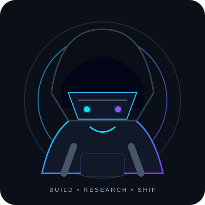

<div align="center">


<a href="https://github.com/Satyendra-00"></a>
<a href="https://github.com/Satyendra-00?tab=repositories"></a>
<a href="https://www.linkedin.com/in/satyendrasiingh/"></a>

</div>

<br>

<table>
<tr>
<td width="66%" valign="top">

# Hello there, fellow <code>&lt;coder /&gt;</code>! 👋

> 🔴 **CAUTION**
>
> • You just found a developer who enjoys turning **real-world problems into software**.

> 🔵 **NOTE**
>
> • 🧠 I'm currently building around **AI, intelligent systems, software engineering and product development**.

> 🟣 **IMPORTANT**
>
> • 🔬 I'm especially interested in **AI-powered products, developer intelligence, mobility and decision systems**.

> 🟡 **WARNING**
>
> • 🚀 Future goal: keep shipping ambitious ideas, go deeper into **system design + AI**, and build products that matter.

> 🟢 **TIP**
>
> • 🤝 If you're building something interesting, **let's collaborate**. Hackathons, experiments and serious side-projects welcome.

</td>
<td width="34%" align="center" valign="middle">



</td>
</tr>
</table>

<div align="center">
<a href="https://www.linkedin.com/in/satyendrasiingh/"></a>
<a href="mailto:satyendrasingh3401@gmail.com"></a>
<a href="https://github.com/Satyendra-00"></a>
</div>

---

## 🧑‍💻 `whoami`

```text
satyendra@research-lab:~$ ./identity

ROLE       → AI & Software Engineer
FOCUS      → AI • Software • Research • Products
MINDSET    → Research first. Build fast. Ship useful.
CURRENTLY  → Building + experimenting + learning
```

## ⚡ What I'm About

<table>
<tr>
<td align="center" width="25%"><h2>🤖</h2><b>AI</b><br><sub>LLMs · AI Apps · Automation</sub></td>
<td align="center" width="25%"><h2>💻</h2><b>Engineering</b><br><sub>Web · APIs · Architecture</sub></td>
<td align="center" width="25%"><h2>🔬</h2><b>Research</b><br><sub>Problems · Experiments · Systems</sub></td>
<td align="center" width="25%"><h2>🚀</h2><b>Products</b><br><sub>Idea → Prototype → Ship</sub></td>
</tr>
</table>

## 🧰 Tech Arsenal

**Languages**

<p></p>

**Frameworks & Backend**

<p></p>

**Tools & Platforms**

<p></p>

## 🚀 Featured Builds

<table>
<tr>
<td width="50%" valign="top">

### 🚦 SignalX
**Real-Time Signal-Aware Speed Guidance**

Traffic-signal intelligence for urban drivers using timing data, phase prediction and location-aware guidance.

`JavaScript` `Leaflet` `OpenStreetMap` `Geoapify`

<a href="https://github.com/Satyendra-00/SignalX">↗ Repository</a> · <a href="https://signall-x.vercel.app/">↗ Live</a>

</td>
<td width="50%" valign="top">

### 📉 FaultLine
**Decision Intelligence from Failure**

A platform for documenting failures, extracting lessons and turning experience into structured knowledge.

`React` `TypeScript` `Supabase` `Gemini` `Vercel`

<a href="https://github.com/Satyendra-00/faultline">↗ Repository</a> · <a href="https://faultlinee.vercel.app/">↗ Live</a>

</td>
</tr>
<tr>
<td width="50%" valign="top">

### 🎯 SkillLens
**Developer Skill Intelligence**

Turns coding activity into a visual skill profile with analytics, recommendations and developer insights.

`React` `TypeScript` `Vite` `Recharts` `Supabase`

<a href="https://github.com/Satyendra-00/Skill-lens">↗ Repository</a>

</td>
<td width="50%" valign="top">

### 📈 SkillPath AI
**AI Career & Skill Guidance**

An AI mentor that analyzes skills, identifies gaps and generates personalized learning and career guidance.

`Python` `Flask` `Gemini` `Supabase` `ElevenLabs`

<a href="https://github.com/Satyendra-00/Skill-path">↗ Repository</a> · <a href="https://skill-path-ai-xi.vercel.app/">↗ Live</a>

</td>
</tr>
</table>

## 🏢 Experience

| Role | Organization | Focus |
|---|---|---|
| **SEO Engineer** | Speedo Express | Technical SEO · Content · Digital Growth |
| **Outreach & Research Intern** | NIET Technology Business Incubator | Outreach · Partnerships · Startup Research |
| **AI / Product Development Intern** | Lenovo India | AI Applications · Web Development · Software Engineering |

## 🧪 Currently Exploring

<p align="center"><code>Agentic AI</code>　<code>Intelligent Systems</code>　<code>System Design</code>　<code>Software Architecture</code>　<code>AI Product Engineering</code></p>

## 📊 GitHub Command Center

<p align="center">

</p>

<p align="center">


</p>

## 🐍 Contribution Matrix

<p align="center">
<picture>
<source media="(prefers-color-scheme: dark)" srcset="https://raw.githubusercontent.com/Satyendra-00/Satyendra-00/output/github-snake-dark.svg">
<source media="(prefers-color-scheme: light)" srcset="https://raw.githubusercontent.com/Satyendra-00/Satyendra-00/output/github-snake.svg">

</picture>
</p>

## 🌐 3D Contribution World

<p align="center">

</p>

## 🔭 What's Next?

```text
[ RESEARCH ] ──→ [ BUILD ] ──→ [ TEST ] ──→ [ SHIP ]
      ↑                                      │
      └──────────── LEARN & ITERATE ─────────┘
```

> **Building is how I learn. Research is how I decide what to build.**

<div align="center">

### 🤝 Let's build something interesting.

<a href="https://www.linkedin.com/in/satyendrasiingh/"></a>
<a href="mailto:satyendrasingh3401@gmail.com"></a>

<br><br>


</div>
