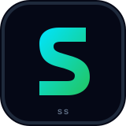

# SATYENDRA SINGH

### AI & Software Engineer

**Research. Build. Innovate.**

 

  

## 👋 About Me

I'm a **B.Tech CSE student and AI & Software Engineer** focused on turning ideas into working products. I enjoy the intersection of **AI, software engineering, research, and product thinking**—especially when technology can solve a real-world problem.

My projects explore **smart mobility, decision intelligence, developer analytics, career guidance, and healthcare**. I learn best by building, testing, breaking, and improving things.

## 🛰️ Mission Control

| | Current Focus |
|---|---|
| 🟢 Building | AI-powered products & practical software systems |
| 🔬 Exploring | Agentic AI, intelligent systems & automation |
| 💻 Engineering | Python • Java • JavaScript • TypeScript • React |
| 📚 Learning | Java, System Design & software engineering fundamentals |
| 🤝 Open to | Hackathons, collaborations & meaningful projects |

## ⚙️ What I Build

<table>
<tr>
<td width="50%">

### 🤖 AI Systems

LLM-powered applications, intelligent workflows, AI integrations and experiments with emerging AI systems.

</td>
<td width="50%">

### 🚦 Real-World Software

Data-driven systems that connect logic, interfaces and real-world constraints to solve practical problems.

</td>
</tr>
<tr>
<td>

### 📊 Developer Intelligence

Tools that turn developer activity and technical data into useful insights, visualizations and recommendations.

</td>
<td>

### 🚀 Product Engineering

From **idea → prototype → deployment**, with a focus on building things people can actually use.

</td>
</tr>
</table>

## 🚀 Featured Work

<table>
<tr>
<td width="50%" valign="top">

### 🚦 SignalX

**Real-Time Signal-Aware Speed Guidance**

Traffic-signal intelligence for urban drivers using signal timing data, phase prediction and location-aware speed guidance.

`JavaScript` `Leaflet` `OpenStreetMap` `Geoapify`

<a href="https://github.com/Satyendra-00/SignalX">Repository</a> · <a href="https://signall-x.vercel.app/">Live Prototype</a>

</td>
<td width="50%" valign="top">

### 📉 FaultLine

**Decision Intelligence from Failure**

A platform for documenting failures, extracting lessons and turning experience into structured, reusable knowledge.

`React` `TypeScript` `Supabase` `Gemini` `Vercel`

<a href="https://github.com/Satyendra-00/faultline">Repository</a> · <a href="https://faultlinee.vercel.app/">Live Demo</a>

</td>
</tr>
<tr>
<td width="50%" valign="top">

### 🎯 SkillLens

**Developer Skill Intelligence**

Transforms coding activity into a visual skill profile with analytics, recommendations and developer insights.

`React` `TypeScript` `Vite` `Recharts` `Supabase`

<a href="https://github.com/Satyendra-00/Skill-lens">Repository</a>

</td>
<td width="50%" valign="top">

### 📈 SkillPath AI

**AI Career & Skill Guidance**

An AI mentor that analyzes skills, identifies learning gaps and creates personalized career and learning guidance.

`Python` `Flask` `Gemini` `Supabase` `ElevenLabs`

<a href="https://github.com/Satyendra-00/Skill-path">Repository</a> · <a href="https://skill-path-ai-xi.vercel.app/">Live Platform</a>

</td>
</tr>
</table>

### ❤️ HealthBridge

A healthcare-focused project exploring how software can improve accessibility and user experience around health-related workflows.

`JavaScript`

<a href="https://github.com/Satyendra-00/HealthBridge">Repository</a>

## 🧰 Tech Stack

  

## 🧠 Currently Exploring

`Agentic AI` &nbsp; `Intelligent Systems` &nbsp; `Software Architecture` &nbsp; `System Design`

## 🏆 Experience

**SEO Engineer — Speedo Express**  
Technical SEO, content systems, optimization and digital growth.

**Outreach & Research Intern — NIET Technology Business Incubator**  
Community outreach, partnership building and startup research.

**AI-Driven Web Application & Product Development Intern — Lenovo India**  
AI-focused product development, web development and software engineering.

## 📊 GitHub Analytics

  
  

  

## 🐍 Contribution Journey

<picture>
  <source media="(prefers-color-scheme: dark)" srcset="https://raw.githubusercontent.com/Satyendra-00/Satyendra-00/output/github-snake-dark.svg">
  <source media="(prefers-color-scheme: light)" srcset="https://raw.githubusercontent.com/Satyendra-00/Satyendra-00/output/github-snake.svg">
  
</picture>

## 🤝 Let's Connect

  
  
  

 

  

