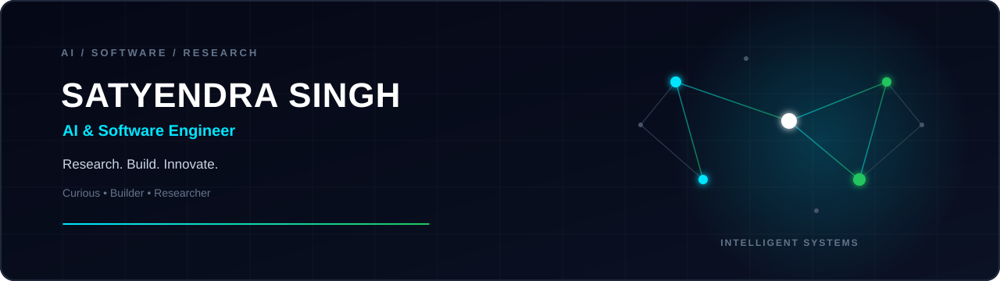

<div align="center">



<br><br>


<br>


</div>

---

# 🚀 About Me

```java
class SatyendraSingh {

    String role = "AI & Software Engineer";

    String[] interests = {
        "Artificial Intelligence",
        "Software Engineering",
        "Research",
        "Problem Solving",
        "Hackathons"
    };

    String currentFocus =
        "Building intelligent software for real-world impact.";

}
```

I am a Computer Science student passionate about designing intelligent software systems that solve practical problems. My work combines **research**, **engineering**, and **product thinking** to build impactful applications across AI, mobility, education, and healthcare.

---

# 🛰 Mission Control

| Status | Value |
|---------|-------|
| 🟢 Current Status | Building AI Projects |
| 📚 Learning | Java • System Design • Agentic AI |
| 🔬 Research | Intelligent Systems |
| 🚀 Focus | AI + Software Engineering |
| 🤝 Open To | Collaboration & Hackathons |

---

# 💻 Tech Stack

### Programming

<p>

</p>

### Frontend

<p>

</p>

### Backend & Database

<p>

</p>

### Tools

<p>

</p>

---

# 🏗 Areas I'm Building In

- 🤖 Artificial Intelligence
- 🚦 Smart Mobility
- 🎓 Education Technology
- ❤️ Healthcare Technology
- 📊 Data-Driven Products

---

# 🚀 Featured Projects

## 🚦 SignalX

> AI-powered traffic signal intelligence platform for smarter urban mobility.

**Highlights**

- Smart route intelligence
- Signal timing prediction
- Speed guidance
- Interactive dashboard

---

## 📉 FaultLine

> Learn from real-world failures through structured storytelling and community knowledge.

**Highlights**

- AI-assisted content
- Structured learning
- Knowledge platform

---

## 🎯 SkillLens

> AI-powered developer skill analysis and visualization platform.

**Highlights**

- Skill analytics
- Developer insights
- Performance visualization

---

## 📈 SkillPath AI

> Voice-first AI career guidance platform for students.

**Highlights**

- AI Career Mentor
- Personalized Learning
- Intelligent Roadmaps

---

## ❤️ HealthBridge

> Technology-driven healthcare platform improving accessibility and user experience.

---

# 🧠 Research Interests

```text
Artificial Intelligence

↓

Agentic AI

↓

Multi-Agent Systems

↓

Human-AI Interaction

↓

Software Engineering

↓

Intelligent Automation
```

---

# 🏆 Experience

### SEO Engineer

**Speedo Express**

- Technical SEO
- Website Optimization
- Performance Improvement

---

### Outreach & Research

**NIET Technology Business Incubator**

- Community Outreach
- Startup Research
- Partnerships

---

### AI Product Development Intern

**Lenovo**

- AI Applications
- Software Development
- Product Engineering

---

# 📈 GitHub Analytics

<p align="center">


</p>

---

# 🔥 Contribution Streak

<p align="center">


</p>

---

# 📊 Contribution Graph

<p align="center">


</p>

---

# 📚 Currently Exploring

- Large Language Models
- Agentic AI
- System Design
- Java Development
- Full Stack Engineering

---

# 🤝 Let's Connect

<p align="center">

<a href="https://github.com/Satyendra-00">

</a>

<a href="https://linkedin.com/in/satyendrasiingh">

</a>

<a href="mailto:satyendrasingh3401@gmail.com">

</a>

</p>

---

<br>

<div align="center">


<br>

⭐ Thanks for visiting my profile.

</div>
